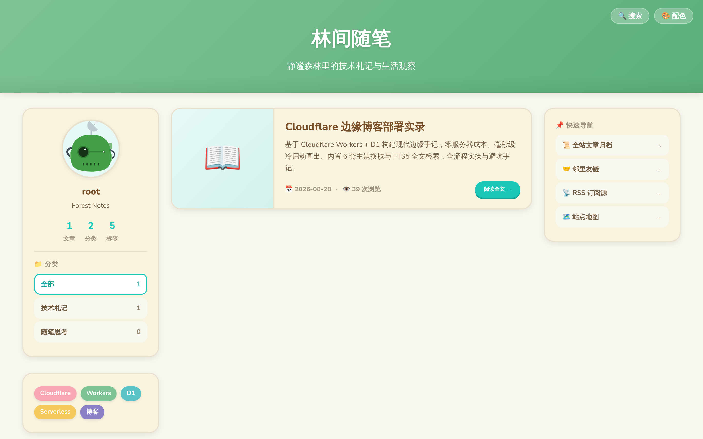
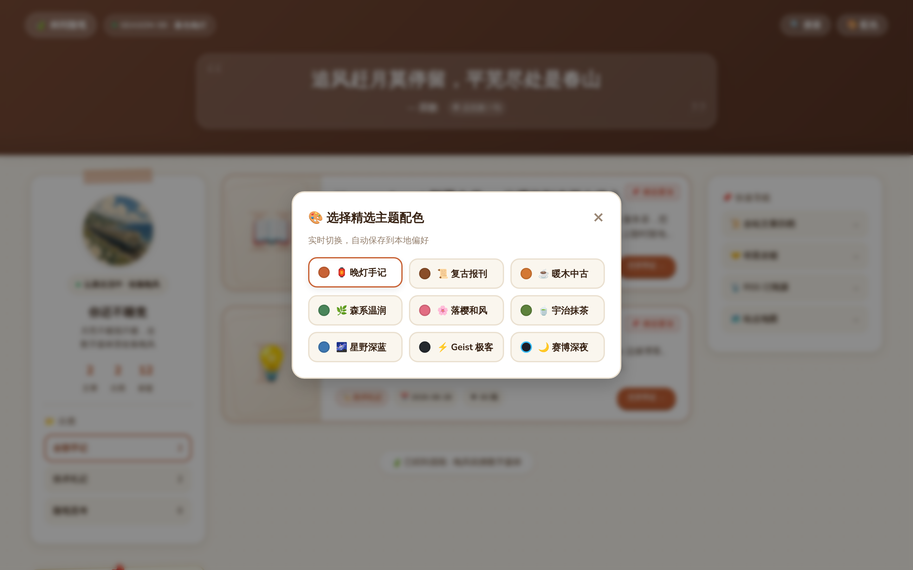
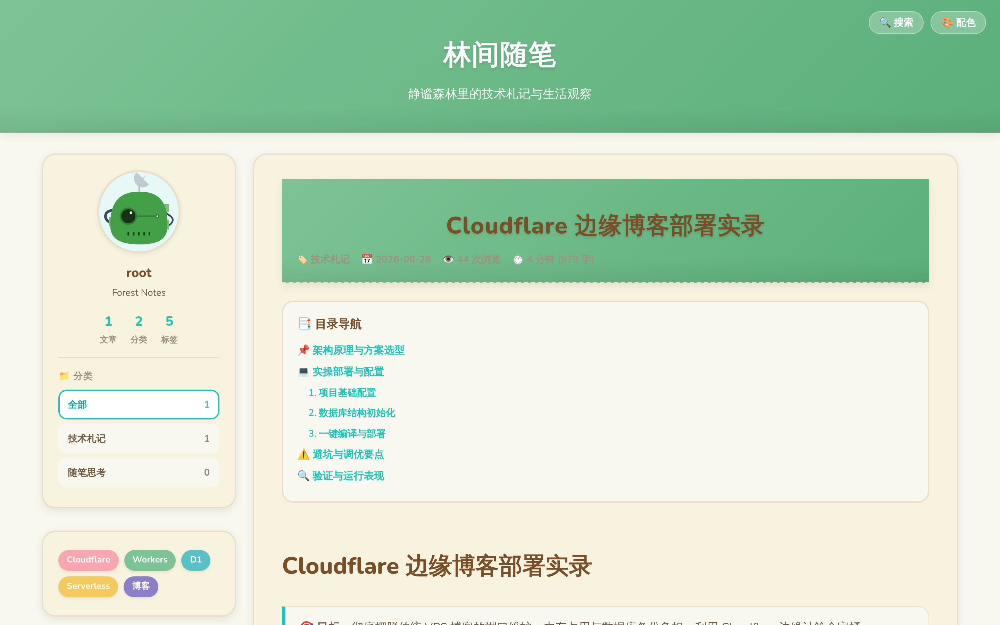

# 🌿 ForestBlog (林间随笔)

> 🍃 **静谧温润、毫秒直出** —— 基于 **Cloudflare Workers + D1 + R2 + Hono** 构建的现代化 Serverless 边缘博客系统。

[](https://deploy.workers.cloudflare.com/?url=https://github.com/shali10/forest-blog)
[](LICENSE)
[](CHANGELOG.md)
[](https://workers.cloudflare.com/)
[](https://hono.dev/)
[-blue.svg)](https://developers.cloudflare.com/d1/)
[](https://www.typescriptlang.org/)

[English](README.en.md) · **简体中文**

兼具静态博客的 **零维护、零服务器月租、全球 CDN 边缘毫秒直出**，与动态博客的 **在线后台管理、实时发布、6套精选主题即时换肤、FTS5 全文检索、灵动名言金句与一键分享** 能力。

🔗 **线上演示 DEMO**：[https://note.0000996.xyz](https://note.0000996.xyz)

---

## 🏗️ 架构设计与数据流向

```
                        ┌────────────────────────────────────────────────────────┐
                        │              Cloudflare Global Edge Network            │
                        │                 (300+ Cities Worldwide)                │
                        └───────────────────────────┬────────────────────────────┘
                                                    │
                                           [ HTTPS Request ]
                                                    │
                                                    ▼
┌────────────────────────────────────────────────────────────────────────────────────────┐
│                        Cloudflare Worker Runtime (Hono Framework)                      │
│                                                                                        │
│  ┌──────────────────┐    ┌──────────────────┐    ┌──────────────────┐    ┌──────────┐  │
│  │   Edge SSR HTML  │    │  FTS5 Search API │    │  Admin SPA Auth  │    │  RSS/XML │  │
│  │   (Zero-Flicker) │    │  (Title+Content) │    │  (JWT HMAC-256)  │    │  Sitemap │  │
│  └────────┬─────────┘    └────────┬─────────┘    └────────┬─────────┘    └────┬─────┘  │
└───────────┼───────────────────────┼───────────────────────┼───────────────────┼────────┘
            │                       │                       │                   │
            ▼                       ▼                       ▼                   ▼
┌─────────────────────────────────────────────────────────┐   ┌──────────────────────────┐
│              Cloudflare D1 (Serverless SQLite)          │   │  Cloudflare R2 (Storage) │
│  - posts / categories / tags / links / settings         │   │  - Uploaded Images       │
│  - posts_fts (FTS5 Full-Text Search Virtual Table)      │   │  - Zero Egress Fees      │
└─────────────────────────────────────────────────────────┘   └──────────────────────────┘
```

---

## 💰 真正的 0 成本 · 免费额度与开销测算

很多开发者担心 Serverless 会因为爬虫或刷量产生意外账单。ForestBlog 充分运行在 **Cloudflare 永久免费额度** 内，且支持在控制台设置超限拦截，实现真正的 **100% 零账单风险**：

| Cloudflare 服务项 | 官方免费额度 (Free Tier) | 个人博客月均实际消耗估算 | 费用判定 |
| :--- | :--- | :--- | :--- |
| **Workers 请求数** | **100,000 次 / 天** (300 万次/月) | 约 3~10 万次 / 月 | 🟢 **完全免费 (占额度 <3%)** |
| **D1 SQL 读取** | **5,000,000 行 / 天** (1.5 亿行/月) | 约 100~300 万行 / 月 | 🟢 **完全免费 (占额度 <2%)** |
| **D1 SQL 写入** | **100,000 行 / 天** (300 万行/月) | 主要是阅读数自增与发文 | 🟢 **完全免费 (占额度 <2%)** |
| **D1 存储容量** | **5 GB** | 1,000 篇长文约 15 MB | 🟢 **完全免费 (占额度 <0.3%)** |
| **R2 对象存储** | **10 GB 存储 + 1000 万次/月读取** | 博客配图约 500 MB~2 GB | 🟢 **完全免费 + 0 出网流量费** |
| **TLS 证书 & CDN** | 自动签发泛域名 SSL + 全球 Anycast CDN | 自动续期，无须人工运维 | 🟢 **0 运维费用** |

---

## 📸 视觉效果展示 (Showcase)

### 1. 首页 · 典雅森系纸感卡片与全功能侧边栏
> 温润纸质质感，清晰的统计卡片、分类导航、精选标签、友情链接与置顶标识。


### 2. 🎨 6 套精选主题调色盘 · 实时一键换肤
> 点击右上角 `🎨 配色` 随时切换：**森系温润、落樱和风、宇治抹茶、星野深蓝、Geist 极客、赛博深夜**。偏好本地持久化记忆，支持跟随系统深色偏好，首屏零闪烁。


### 3. 📖 沉浸式长文阅读 · 目录 TOC 与精调排版
> 顶部平滑阅读进度条、代码高亮一键复制、文章目录智能跳转、图片点击灯箱放大与 Giscus 社区交流。


### 4. 📱 移动端极致适配 · 丝滑抽屉导航
> 针对手机端深度调优，抽屉式导航栏、自适应表格横向滚动、悬浮一键回到顶部，小屏幕阅读体验绝佳。


---

## ✨ 核心特性一览

| 模块 | 特性亮点 |
| :--- | :--- |
| **⚡ 边缘渲染 (Edge SSR)** | Cloudflare Workers 全球 300+ 边缘节点直出 HTML，首屏 TTFB < 45ms，SEO 极佳。 |
| **🎨 6套精调主题** | 内置森系、落樱、抹茶、深蓝、Geist 极客、赛博深夜，支持实时无刷切换与系统深色自适应。 |
| **🔍 全文即时检索** | 基于 SQLite FTS5 全文索引 + LIKE 混合双模引擎，支持 `Ctrl + K` 快捷键瞬间调出搜索弹窗。 |
| **📝 开箱即用后台** | 访问 `/admin/` 即可管理文章、分类、友链与全站配置，内置 Markdown 工具栏与置顶/草稿开关。 |
| **💬 灵动名言金句** | 顶栏集成精选文学/哲思名言库，支持点击/刷新即时呼吸切换，充满数字花园人文气息。 |
| **🖼️ 图片灯箱 & 代码高亮** | 文章内图片支持点击放大预览 (Lightbox)，代码块集成 Prism 语法着色与一键复制代码。 |
| **📱 全端响应式** | 手机端专属汉堡菜单抽屉导航，顶部平滑阅读进度条与悬浮回到顶部按钮。 |
| **📡 标准生态** | 原生输出 RSS 2.0 订阅源 (`/rss.xml`)、搜索引擎 Sitemap (`/sitemap.xml`) 与 OpenGraph 社交卡片。 |
| **💾 数据自主掌控** | 后台支持一键导出全站数据为标准 JSON 备份，随时迁移无绑定。 |

---

## 🚀 极速部署指南 (3 种方式任意选)

---

### 方案 A：Fork 一键部署 (最推荐 · 纯网页点击)

只需点击下方按钮，Cloudflare 会引导你自动 Fork 本仓库并完成边缘 Worker 部署：

[](https://deploy.workers.cloudflare.com/?url=https://github.com/shali10/forest-blog)

1. 点击上方 **Deploy with Workers** 按钮。
2. 登录你的 Cloudflare 账号，按照网页指引授权 GitHub 并 Fork 本项目。
3. 在 Cloudflare 控制台为其绑定一个 **D1 数据库**（名称：`forest-blog-db`）。
4. 在 D1 控制台的 **Console** 中粘贴执行本项目根目录的 `schema.sql` 即可完成初始化！

---

### 方案 B：Cloudflare 控制台 Git 导入 (持续集成部署)

1. **Fork 仓库**：点击本项目右上角 **Fork**，克隆一份到你自己的 GitHub 账号下。
2. **登录 Cloudflare**：进入 [Cloudflare 控制台](https://dash.cloudflare.com/)。
3. **创建 D1 数据库**：
   - 导航到 **Storage & Databases** → **D1 SQL Database** → **Create database**。
   - 数据库名称输入 `forest-blog-db`，创建完成后进入 **Console**。
   - 将本项目 `schema.sql` 的内容复制粘贴进去并点击 **Execute** 执行初始化。
4. **连接 Git 部署**：
   - 导航到 **Compute (Workers & Pages)** → **Create Application** → **Pages** → **Connect to Git**。
   - 选择刚才 Fork 的 `forest-blog` 仓库，点击 **Begin setup**。
   - 在 **Settings** → **Bindings** 中添加 D1 数据库绑定（Variable name: `DB`，绑定刚才创建的 `forest-blog-db`）。
5. **点击 Save and Deploy**：等待 10 秒即刻上线！

---

### 方案 C：CLI 终端快速部署 (极客开发者 · 3步搞定)

```bash
# 1. 克隆代码并安装依赖
git clone https://github.com/shali10/forest-blog.git
cd forest-blog
npm install

# 2. 创建 Cloudflare D1 数据库并初始化表结构
npx wrangler d1 create forest-blog-db
# 将输出的 database_id 填入 wrangler.toml
npm run db:init:remote

# 3. 一键发布上线
npm run deploy
```

> 💡 **设置管理员强密码**：
> ```bash
> npx wrangler secret put ADMIN_PASSWORD
> # 输入自定义管理员密码（默认未设置时密码为 admin123）
> ```

---

## 📁 目录结构

```
forest-blog/
├── .github/
│   └── workflows/
│       └── deploy.yml       # GitHub Actions 自动化 CI/CD 部署
├── docs/
│   └── images/              # 高清效果图与主题展示
├── src/
│   ├── index.ts             # Hono 路由入口与 SSR 挂载
│   ├── auth.ts              # HMAC-SHA256 Token 签名鉴权
│   ├── db.ts                # D1 数据库交互与 FTS5 检索逻辑
│   ├── markdown.ts          # Markdown 解析、目录 TOC 提取与代码高亮
│   ├── routes/
│   │   ├── admin.ts         # 管理后台 API、Markdown 工具栏与数据导出
│   │   └── api.ts           # 公开 REST API、RSS 与 Sitemap
│   └── theme/
│       ├── styles.ts        # 6 套调色盘 CSS 变量、进度条与极简样式
│       └── views.ts         # Edge SSR 页面模板 (首页/文章/归档/友链/Giscus)
├── schema.sql               # D1 数据库结构与初始化数据
├── wrangler.toml            # Cloudflare Workers 部署配置
├── package.json
└── tsconfig.json
```

---

## 📄 开源协议

本项目基于 [MIT 协议](LICENSE) 开源，欢迎自由 Fork、修改与分享！
